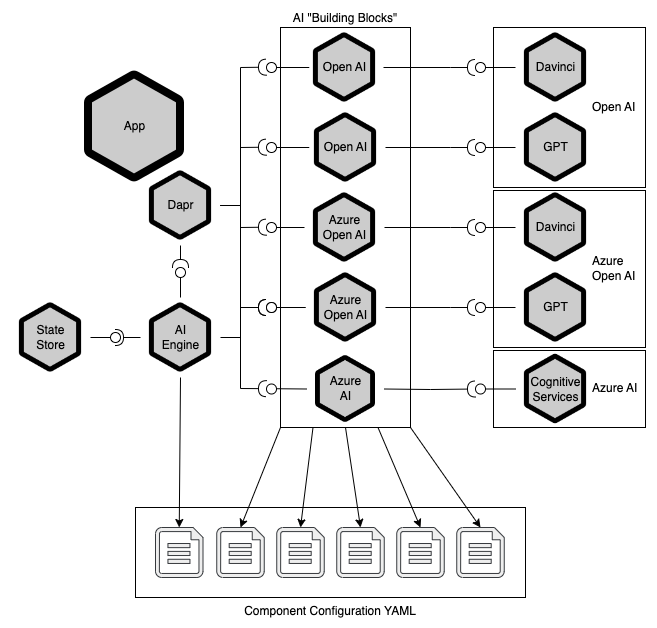

# Dapr AI Bindings

A sample using Dapr extensibility to provide an abstraction over multiple AI services.

## Background

An application that intends to make use of AI services must make many decisions.

 - Which AI service to use?
 - Which language model and settings to use?
 - Which SDK to use, if not making invoking services directly?
 
Each of these decisions has the potential to tightly couple the application to a specific AI service, model, or SDK, which can make it difficult for developers to respond to changes in the AI landscape as the field quickly evolves. Given the interest in consuming AI services in applications combined with a rapidly expanding marketplace offering services, developers may fear becoming locked into a single service, model, API, or platform.

[Dapr](https://dapr.io/) provides an abstraction layer for different types of fundamental services such as state, pub-sub, secrets, and configuration, called "building blocks", that provide applications a high degree of flexibility in which (and how) services are used. While not an official building block today, Dapr can still be used to provide a similar abstraction layer for AI services.

## Architecture

Dapr applications communicate with external services through a set of configured components, accessible via the Dapr sidecar process/container via HTTP or gRPC, with components of the same category conforming to the same interface. In this way, applications are shielded from the particulars of any individual component and can easily switch components with only configuration changes and not application (i.e. source) changes.

While the Dapr runtime provides a large selection of built-in components for various services, developers can create "pluggable" components (using Dapr 1.9 onward) to access services not yet part of the runtime (or might be internal to the enterprise). Pluggable components can be created (today) for the state store, pub-sub, and input/output binding building blocks.

This sample uses a set of output binding pluggable components to create an abstraction layer atop several different AI services: Open AI, Azure Open AI, and other Azure AI offerings such as Cognitive Services. Because each component implements the same set of operations, using the same request/response data, the application can switch between them no code changes. Cnfiguration files are then used to allow components the ability to connect with their respective services and control how the components function.

The application itself is a basic web API with two endpoints, `/complete` and `/summarize`, that act as a proxies for requests to the AI binding components to enable easy testing.  Those endpoints support an optional `component` query parameter to demonstrate the application switching between components with no code changes.



### AI Building Block

The "AI building block" consists of an output binding supporting the following operations:

- **`completeText`:** request a "completion" of (i.e a response to) a user's text prompt
- **`summarizeText`:** request the summarization of a text document (provided inline or via an URL)

> Note that components are not required to support all defined operations.

#### Text Completion

Components supporting the `completeText` operation expect a request of the form:

```json
{
   "system": "<(Optional) Instructions for how the AI should respond to the user>",
   "prompt": "<The user's prompt (e.g. 'How are you?')>"
}
```

> Note that some language models may ignore the system instructions, even when provided.

The components make the request of their respective service and are then expected to return a response of the form:

```json
{
   "response": "<The AI response to the user's prompt>"
}
```

#### Text Summarization

Components supporting the `summarizeText` operation expect a request of the form:

```json
{
   "text": "<If provided, the actual text to summarize>",
   "url": "<If provided, a URL for the text document to summarize>"
}
```

The components make the requeset of their respective service and are then expected to return a response of the form:

```json
{
   "summary": "<The AI summarization of the text>"
}
```

### AI Building Block Components

#### Open AI

The Open AI component (`bindings.open-ai`) uses the Open AI service to implement text completion and summarization. The component can be configured to use both "chat" and non-chat language models.

Component configuration metadata:

| Name | Required | Description |
|---|---|---|
| `endpoint` | Yes | The endpoint for the AI service, typically `https://api.openai.com` |
| `key` | Yes | The API key used to access the AI service |
| [`model`](https://platform.openai.com/docs/api-reference/completions/create#completions/create-model) | Yes | The name of the language model to use (e.g. `text-davinci-003`) |
| [`maxTokens`](https://platform.openai.com/docs/api-reference/completions/create#completions/create-max_tokens) | No | The maximum number of tokens to generate in the completion |
| `summarizationInstructions` | No | Instructions given to the AI service that describe *how* to summarize the text. |
| [`temperature`](https://platform.openai.com/docs/api-reference/completions/create#completions/create-temperature) | No | The sampling temperature to use, between 0 and 2. Higher values will generate more random completions while lower values will generate more deterministic completions. |
| [`topP`](https://platform.openai.com/docs/api-reference/completions/create#completions/create-top_p) | No | Consider the results with top_p probability mass, between 0 and 1. |

> Note: use either `temperature` or `topP` but not both.

#### Azure Open AI

The Azure Open AI component (`bindings.azure-open-ai`) uses an Azure Open AI instance to implement text completion and summarization. The component can be configured to use both "chat" and non-chat language models.

Component configuration metadata:

| Name | Required | Description |
|---|---|---|
| `endpoint` | Yes | The endpoint for the AI instance, typically `https://<instance>.openai.azure.com` |
| `key` | Yes | The API key used to access the AI instance |
| `deployment` | Yes | The name of the deployed language model to use |
| [`maxTokens`](https://learn.microsoft.com/en-gb/azure/cognitive-services/openai/reference#completions) | No | The maximum number of tokens to generate in the completion |
| `summarizationInstructions` | No | Instructions given to the AI service that describe *how* to summarize the text. |
| [`temperature`](https://learn.microsoft.com/en-gb/azure/cognitive-services/openai/reference#completions) | No | The sampling temperature to use, between 0 and 2. Higher values will generate more random completions while lower values will generate more deterministic completions. |
| [`topP`](https://learn.microsoft.com/en-gb/azure/cognitive-services/openai/reference#completions) | No | Consider the results with top_p probability mass, between 0 and 1. |

> Note: use either `temperature` or `topP` but not both.

#### Azure AI

The Azure AI component (`bindings.azure-ai`) uses Azure Cognitive Services to implement text summarization.

Component configuration metadata:

| Name | Required | Description |
|---|---|---|
| azure-ai-endpoint | Yes | The endpoint for the Cognitive Services instance, typically `https://<instance>.cognitiveservices.azure.com` |
| azure-ai-key | Yes | The API key used to access the instance |

> Note that this component does not support text completion.

## Prerequisites

- [Dapr 1.10](https://dapr.io/) or later
- [.NET 7](https://dotnet.microsoft.com/) or later
- Linux, MacOS, or Windows using WSL

To use the Chat GPT binding, you must have an Open AI account and an [API key](https://platform.openai.com/account/api-keys).

To use the Azure AI binding, you must have an [Azure Cognitive Services](https://azure.microsoft.com/en-us/products/cognitive-services/) instance and its access key.

To use the Azure Open AI binding, you must have an [Azure Open AI](https://azure.microsoft.com/en-us/products/cognitive-services/openai-service) instance and its access key. This sample also expects that you've deployed two language models to the service, one named `davinci` and the other named `gpt-35`. (The exact models used for those deployments is not as important, but you could use `text-davinci-003  ` and `gpt-35-turbo`, respectively.)

To use the `.http` files to send requests, install the [REST Client](https://marketplace.visualstudio.com/items?itemName=humao.rest-client) VS Code extension.

## Setup

1. Configure the Dapr components.

   Create a JSON file called `secrets.json` in the repo root folder to hold the access keys. It should look something like:

   ```json
   {
      "azure-ai-endpoint": "https://<name>.cognitiveservices.azure.com",
      "azure-ai-key": "<Azure Cognitive Services key>",

      "azure-open-ai-endpoint": "https://<name>.openai.azure.com"
      "azure-open-ai-key": "<Azure Open AI API key>"

      "open-api-endpoint": "https://api.openai.com"
      "open-api-key": "<Open AI API key>"
   }
   ```

1. Build and run the pluggable components.

   ```bash
   cd src/DaprAI.PluggableComponents
   dotnet run
   ```

1. Build and run the application.

   ```bash
   dapr run -f ./dapr.yaml
   ```

1. Send a completion request:

   ```http
   POST http://localhost:5111/complete HTTP/1.1
   content-type: application/json

   {
       "prompt": "How are you?"
   }
   ```

   See the response from Chat GPT:

   ```http
   HTTP/1.1 200 OK
   Connection: close
   Content-Type: application/json; charset=utf-8
   Date: Mon, 06 Mar 2023 22:01:23 GMT
   Server: Kestrel
   Transfer-Encoding: chunked

   {
     "response": "\n\nI'm doing well, thanks for asking. How are you?"
   }
   ```

1. Send a summarization request:

   ```http
   POST http://localhost:5111/summarize HTTP/1.1
   content-type: application/json

   {
       "text": "Jupiter is the fifth planet from the Sun and the largest in the Solar System. It is a gas giant with a mass one-thousandth that of the Sun, but two-and-a-half times that of all the other planets in the Solar System combined. Jupiter is one of the brightest objects visible to the naked eye in the night sky, and has been known to ancient civilizations since before recorded history. It is named after the Roman god Jupiter.[19] When viewed from Earth, Jupiter can be bright enough for its reflected light to cast visible shadows,[20] and is on average the third-brightest natural object in the night sky after the Moon and Venus."
   }
   ```

   See the response from Chat GPT:

   ```http
   HTTP/1.1 200 OK
   Connection: close
   Content-Type: application/json; charset=utf-8
   Date: Mon, 20 Mar 2023 21:39:05 GMT
   Server: Kestrel
   Transfer-Encoding: chunked

   {
   "summary": "Jupiter is the largest planet in the Solar System, and it is a gas giant. With a mass two-and-a-half times that of all the other planets in the Solar System combined, it is also the fifth planet from the Sun. Jupiter has been known to ancient civilizations since before recorded history, and it is"
   }
   ```


   > By default, requests will be made to Open AI's Chat GPT. You can use the query parameter to specify which binding to use:
   >  - Open AI's Chat GPT (e.g. `?component=open-ai-gpt`)
   >  - Open AI's Davinci (e.g. `?component=open-ai-davinci`)
   >  - Azure Open AI Davinci (e.g. `?component=azure-open-ai-davinci`)
   >  - Azure Open AI Chat GPT (e.g. `?component=azure-open-ai-gpt`)
   >  - Azure AI (e.g. `?component=azure-ai`)
   >
   > Not all operations (i.e. prompt or summarize) are supported by all bindings.